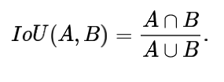
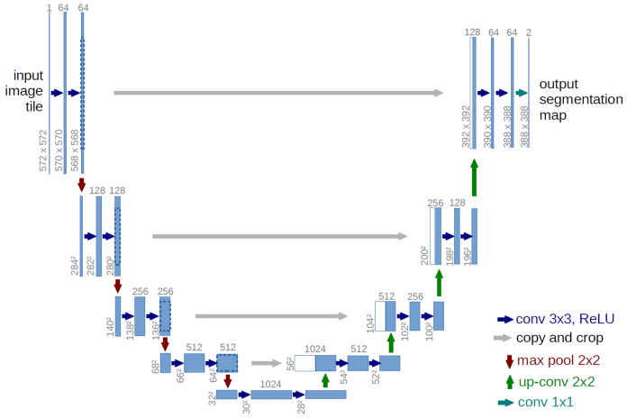
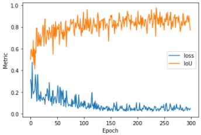
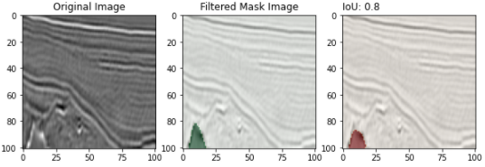
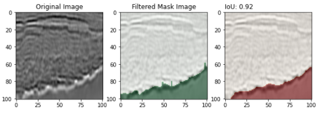

# Salt_Identification

## Solution of a Kaggle Problem - TGS Salt Identification

### Overview

There are a lot of areas on earth's suface having the huge source of oil and gases along with the salt. But knowing about those salt deposits are not so easy task. Even if we have original seismic images, then these images also expect some form of human experts intervention. Since knowing about the salt deposits is totally based on the understanding of expert, so it can lead to the dangerous situations for oil and gas drillers.

To create the most accurate seismic images and 3D renderings, TGS (the world’s leading geoscience data company) is hoping Kaggle’s machine learning community will be able to build an algorithm that automatically and accurately identifies if a subsurface target is salt or not.

### Problem Statement

By looking at the overview we got the idea, that given an input seismic image the model has to predict the presence or absense of salt deposits. So ultimately the problem is the Image Segmentation problem.

### Data

Since it's a Kaggle problem, so data can be downloaded from the below mentioned link -

https://www.kaggle.com/c/tgs-salt-identification-challenge/data

The given dataset is fairly small, it just contain 4000 seismic images.

### Performance Metric

Since it is a Image Segmentation problem. So for that IoU (Intersection over Union) would be the perfect one. And Kaggle also mentioned to measure performance of the model in terms of IoU.

IoU can be mathematically represented as - 

### Model 

For this task I picked U-net model, which works very well with the image segmentation tasks. The architecture of the U-net architecture is below - 

### Things I've used
- Plateform - Google Colab
- Framework - PyTorch
- Augmentation - grayscale using TorchVision
- Optimizer - Adam with default parameters
- Loss function - BCEWithLogitsLoss
- Callbacks - ReduceLROnPlateau

### Results

The below plot is used to represent the **Epoch vs. IOU** and **Epoch vs. loss**.

In the below images we can see a simple U-net model can work really well for the image segmentation tasks.

### Kaggle Submission Score
- Public Leaderboard - 0.76699
- Private Leaderboard - 0.78776

### Future Work

The model is working well but still not so good. Needs further improvement. So these are the things to try in future -
- Try another models, like FastFCN, Mask RCNN etc.
- More augmentation, since dataset is fairly small
- By changing the loss, as mentioned in the kaggle discussion lots of high ranker have used **lovasz loss**.

### Deployment

- Frontend - HTML
- Backend - Flask, Python
- Deploying Plateform - AWS EC2, GCP Compute Engine

**Link to the web app (AWS)-** http://ec2-15-207-221-240.ap-south-1.compute.amazonaws.com:8080/

**Link to the web app (GCP)-** 34.74.155.95:5000
